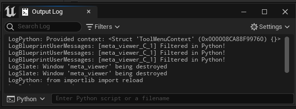
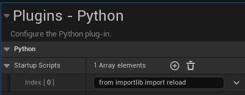

# <span style="color:white">Python Conveniences</span>

When developing code for Unreal there are a few conveniences we can undertake to make our lives easier.

This page covers the [unreal_systems](../unreal_plugin/PythonRecipeBook/Content/Python/demo/unreal_systems.py) python module


## <span style="color:yellow">Reload is our friend</span>
<ul>

When developing Unreal Python tools I regularly using the Python input on the Output Log Window:



We don't always need to relaunch Unreal to try out a few changes to a module's logic, instead we can reload it
here and try again:
    
```python
from importlib import reload
from demo import bp_library
    
reload(bp_library)

# Result: Display: Reload/Re-instancing Complete: 1 class changed
```
    
Our blueprint function library is now updated in Unreal!

One of the few lines I cannot recommend enough to include in the Python Plugin settings is `from importlib import reload`:



With this setting added the `reload` function will be automatically available in the Editor's Python Interpreter.
Any common imports you find yourself constantly running can be added to this area, they will be instantly available on Editor startup.

</ul>
<br>


## <span style="color:yellow">Convenience Modules For Unreal Systems</span>
<ul>

As you read the rest of the documentation you will encounter many code snippets using something from the
[ue](../unreal_plugin/PythonRecipeBook/Content/Python/demo/unreal_systems.py) module, this is a preference of mine to initialize most
unreal libraries and subsystems in a convenience module and reference that elsewhere. 
This is done to reduce the clutter in other tools, letting them focus on their actual logic instead of 
initializing the same libraries again and again.

Instead of initializing each system required per function or per module:
```python
def is_content_browser_loaded():
    asset_registry_helper = unreal.AssetRegistryHelpers()
    asset_registry = asset_registry_helper.get_asset_registry()
    return not asset_registry.is_loading_assets()
```

We can set up the asset registry and its helper in one convenience module and reference that module where ever needed:
```python
def is_content_browser_loaded():
    return not unreal_systems.asset_registry.is_loading_assets()
```

`ue` is lightly populated in this project, but it is where I would place most libraries and initialize any subsystems. 
Subsystems are especially great for this as some are accessed using 
[get_editor_subsystem()](https://docs.unrealengine.com/5.1/en-US/PythonAPI/module/unreal.html#unreal.get_editor_subsystem)
while others use
[get_engine_subsystem()](https://docs.unrealengine.com/5.1/en-US/PythonAPI/module/unreal.html#unreal.get_engine_subsystem).

This module saves me from excess lines in my actual tool code and saves me from needing to remember 
whether something is an `engine` or `editor` sub system. This is just a preference though, as such feel free to ignore it
if you'd like.

</ul>
<br>


# <span style="color:yellow">Summary</span>
<ul>

The topic of convenience is subjective and up to the user, more than anything just remember to watch for repetitive
tasks and you might find ways to make them less so.

</ul>
