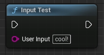
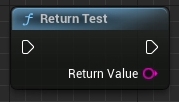
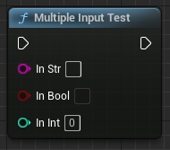
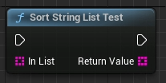
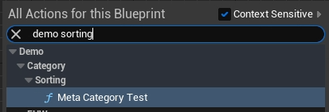
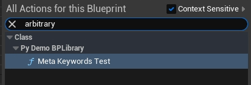
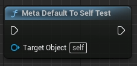
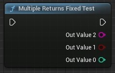

# <span style="color:white">Python BP Function Libraries in Unreal</span>

Python based Blueprint Functions allow more users access to extend the functionality 
of the Editor. It might not be able to do everything that c++ can, 
but a lot of functionality is already exposed and the potential is already beyond impressive!

This page covers the [bp_library](../unreal_plugin/PythonRecipeBook/Content/Python/demo/bp_library.py) python module

<br>


# <span style="color:yellow">An Important Warning</span>

This page covers an implementation that is not recommended for general use by Epic. If any Editor Actors or Editor
Tools reference Python-created Blueprint Function nodes (the implementation covered on this page) 
they have a chance of breaking the next time you open the Unreal Project.

For general use it is recommended to use the Epic-provided `Execute Python Script` Node. If you have more
control over your Python-based tools/assets, aren't afraid of c++, and would still like to explore the
option on this page please also read the
[Editor Utility Widgets documentation page](./07_editor_utility_widgets.md#unreal-shutdownstartup-and-python-based-bp-nodes)
as well. The implementation covered on this page is recommended if you're comfortable with c++, have reliable
control over how your Python tools are deployed, and accept the risks of this method.

<br>


# <span style="color:yellow">Declaring a BP Function Library class</span>
<ul>
We first need to create a class which will store all of our Blueprint Functions:

```python
import unreal

@unreal.uclass()
class PyDemoBPLibrary(unreal.BlueprintFunctionLibrary):
    """Blueprint functions declared in this class will be available in Editor"""
    # functions to follow...
```
This `PythonFunctionLibrary` class will be where all following function node examples are declared.

- The [@unreal.uclass()](https://docs.unrealengine.com/5.1/en-US/PythonAPI/module/unreal.html#unreal.uclass)
decorator tells Unreal to expose it to the Editor
- The `PyDemoBPLibrary` class name is arbitrary, name it uniquely as you please!
- The [unreal.BlueprintFunctionLibrary](https://docs.unrealengine.com/5.1/en-US/PythonAPI/class/BlueprintFunctionLibrary.html#unreal.BlueprintFunctionLibrary)
base class handles everything else
    
<br>
For the rest of this page we'll be adding functions to this class, any function added to this class will be made available to the Blueprint Graph.
</ul>

<br>


# <span style="color:yellow">Declaring Functions - Decorator Overview</span>
<ul>

Functions are exposed to Unreal through decorators, there are two areas this page will focus on. This section is on the expected data: what's our
input and what's our return. In the following section we'll cover how to organize and modify the behavior of the function via metadata.


## <span style="color:orange">Basic function example</span>
<ul>

For all blueprint function this is our starting block:
<table><tr><td>


</td><td>

```python
@unreal.ufunction(static=True)
def basic_function_test():
    """Python Blueprint Node -- run Python logic!"""
    print("Running python!")
```

</td></tr>
</table>

- [@unreal.ufunction()](https://docs.unrealengine.com/5.1/en-US/PythonAPI/module/unreal.html#unreal.ufunction)
converts our Python function into a Blueprint Graph node, all of our settings will go in here.
- `static=True` tells Unreal that a `self` arg is not expected, all of our functions will have this
- Any Python docstring will also show in Unreal as the tool tip

</ul>


## <span style="color:orange">Single Input / Output</span>
<ul>

To pass blueprint data to Python and back we must tell it what type of data we're expecting to provide/receive:
    
<table><tr><td>



</td><td>

```python
@unreal.ufunction(static=True, params=[str])
def input_test(user_input = "cool!"):
    """Python Blueprint Node -- print the text input"""
    print(f"Provided input: {user_input}")
```

</td></tr>

<tr><td>



</td><td>

```python
@unreal.ufunction(static=True, ret=str)
def return_test():
    """
    Python Blueprint Node -- return a string!
    returns:
        str
    """
    return "cool!"
```

</td></tr>

</table>

- `params` Is where we map the input type of each kwarg in sequential order
    - Any default kwarg values will display in the BP Graph node
- `ret` Is where we tell it what return type to expect

<br>

note: It is important to always return the expected type to Unreal, Unreal will ignore anything that doesn't match the expected type
</ul>


## <span style="color:orange">Multiple Input / Output</span>
<ul>

To pass multiple args or returns we may provide a list/tuple:
<table><tr><td>



</td><td>

```python
@unreal.ufunction(static=True, params=[str, bool, int])
def multiple_input_test(in_str, in_bool, in_int):
    """Python Blueprint Node -- multiple inputs (string, bool, int)"""
    print(
        f"{in_str} ({type(in_str)}) | "
        f"{in_bool} ({type(in_bool)}) | "
        f"{in_int} ({type(in_int)})"
    )
```

</td></tr><tr><td>


</td><td>

```python
@unreal.ufunction(static=True, ret=(int, bool, str))
def multiple_returns_test():
    """Python Blueprint Node -- Return (str, bool, int)

    NOTE: the 'ret' decorator arg is reversed 
          from the actual python return
    """
    return "Awesome", True, 5
```

</td></tr>
</table>

- to provide `str, bool, int` you tell unreal to expect `str, bool, int`
- To return `str, bool, int` you tell unreal to expect `int, bool, str`
  - That's right, the return is reverse order!
- Unreal will also add a bogus `returnValue` bool that does nothing

<br>
    
The bogus returnValue will be revisited later in the [HidePin](02_blueprint_function_libraries.md#hide-pin-fixes-multiple-returns) metadata arg below
</ul>


## <span style="color:orange">Handling Lists</span>
<ul>

When handling lists you must use the [unreal.Array(type)](https://docs.unrealengine.com/5.1/en-US/PythonAPI/class/Array.html#unreal.Array) 
class and declare its content:
<table><tr><td>



</td><td>

```python
@unreal.ufunction(
    static=True, ret=unreal.Array(str), 
    params=[unreal.Array(str)]
)
def sort_string_list_test(in_list):
    """
    Python Blueprint Node -- Sort a list of strings, 
    useful for managing options in editor tool
    """
    return sorted(in_list)
```

</td></tr>
</table>

- This example uses a list of `str` however it can be any data type, even `unreal.actor`!
- It's okay to return a python List as well, but if any of its contents are not `str` it will throw an error

<br>

This example is one of the strengths of Python for Editor Utilities, sorting in Python is much easier than Blueprints 
</ul>


## <span style="color:orange">Pure functions (no exec in/out connections)</span>
<ul>
    
For getter functions we can use the `pure` flag:
    
<table><tr><td>


</td><td>

```python
@unreal.ufunction(ret= str, pure=True, static=True)
def pure_function_test() -> str:
    """
    Python Blueprint Node -- 
    Pure functions have no execution flow pins,
    a pure function is intended for getter functions
    that do not change the state of assets in Unreal
    """
    return os.environ.get("USER", "unknown user")
```

</td></tr>
</table>

Pure functions promise not to change the state of the Unreal class calling them. They are great for getting data, running calculations on values, or performing conversions to name a few use cases. 

</ul></ul>
<br></br>


# <span style="color:yellow">Declaring Functions - Metadata Specifiers</span>
<ul>

This section covers the `meta` arg, which represents Metadata Specifiers. Given a dict of specifiers this flag grants further control over how the Blueprint node is organized, displayed, and behaves. To learn more about Metadata Specifiers [this Unreal page is a great resource](https://docs.unrealengine.com/5.1/en-US/metadata-specifiers-in-unreal-engine/).


## <span style="color:orange">Category</span>
<ul>

The `Category` meta dict member controls how the function is organized in the right click menu:
<table><tr><td>



</td><td>

```python
@unreal.ufunction(
    static=True, 
    meta=dict(Category="demo | category | sorting")
)
def meta_category_test():
    """
    Python Blueprint Node --
    Category organizes this node 
    in the right click menu
    Use | to create nested levels
    
    """
    pass
```

</td></tr>
</table>

- The `|` separator is how you set multiple depth levels in the menu
</ul>


## <span style="color:orange">Key Words</span>
<ul>

The `KeyWords` meta dict member registers additional words that may be used to find our function:

<table><tr><td>



</td><td>

```python
@unreal.ufunction(
    static=True, 
    meta=dict(KeyWords="random arbitrary keywords")
)
def meta_keywords_test():
    """
    Python Blueprint Node -- 
    KeyWords help the discovery of 
    this node in the BP Graph right click menu
    """
    pass
```

</td></tr>
</table>

You can find a function buy its name, its category, or its keywords
</ul>


## <span style="color:orange">Compact Title</span>
<ul>

The `CompactNodeTitle` meta dict member tells our function to use a compact display in the Blueprint Graph:

<table><tr><td>


</td><td>

```python
@unreal.ufunction(static=True, meta=dict(CompactNodeTitle="UEPY"))
def meta_compact_name_test():
    """Python Blueprint Node -- CompactNodeTitle"""
    pass
```

</td></tr>
</table>
</ul>


## <span style="color:orange">Default To Self</span>
<ul>

The `DefaultToSelf` meta dict member will populate the given arg with a reference to the containing BP Class that's calling it:

<table><tr><td>



</td><td>

```python
@unreal.ufunction(
    static=True, 
    params=[unreal.Actor], 
    meta=dict(DefaultToSelf="target_object")
)
def meta_default_to_self_test(target_object):
    """
    Python Blueprint Node -- DefaultToSelf 
    (The BP Class calling this Function)
    """
    print(f"target object: {target_object}")
    pass
```

</td></tr>
</table>

- The string provided to `DefaultToSelf` must match a kwarg name exactly
- This decorator parameter is handy for any actor-focused functions
</ul>


## <span style="color:orange">Hide Pin (Fixes Multiple Returns)</span>
<ul>

The `HidePin` meta dict member tells Unreal to hide the desired pin, we can use this to fix the multiple returns example:

<table><tr><td>



</td><td>

```python
@unreal.ufunction(
    static=True, 
    ret=(int, bool, str), 
    meta=dict(HidePin="returnValue")
)
def multiple_returns_fixed_test():
    """Python Blueprint Node -- Return (str, bool, int)"""
    return "Awesome", True, 5
```

</td></tr>
</table>

- This metadata parameter does have other potential uses, but its #1 use for me is to hide that bogus `returnValue`

</ul>


## <span style="color:orange"> Determines Output Type</span>
<ul>

The `DeterminesOutputType` meta dict member controls our function's return data type:

<table><tr><td>


</td><td>

```python
@unreal.ufunction(
  static=True, 
  ret=unreal.Array(
    unreal.EditorUtilityObject
  ),
  params=[
    unreal.Array(unreal.EditorUtilityObject)
  ],
  pure=True,
  meta=dict(
    DeterminesOutputType="array_to_match"
  )
)
def get_item_data_for_euw(
  array_to_match=unreal.Array(
    unreal.EditorUtilityObject
  )
)
```

</td></tr>
</table>

- the `Items` variable in the graph is an Array of `Meta Item Data`. this class is a Blueprint asset created in the Editor
- `Meta Item Data`'s class inherits from `Editor Utility Object` 
- You still need to provide the `ret` and `params`, use a parent class of what will actually be provided

Without this meta decorator it would have returned an `Editor Utility Object` array. This allows us to
return custom assets directly from Python, no post-conversion necessary!

</ul>
</ul>
<br></br>


# <span style="color:yellow">Summary</span>
<ul>
There's a lot we can do when it comes to setting up Python-based BP Function Libraries.
It has some quirks, but it presents a lot of power and versatility to extending editor functionality without needing to know C++.

Here's some additional links I found useful or learned from:
 - [medium article by Filip Sivák](https://filipsivak.medium.com/python-in-unreal-engine-the-undocumented-parts-7585434f5d76)
 - [medium article by Joe Graf](https://medium.com/@joe.j.graf/building-ue4-blueprint-function-libraries-in-python-746ea9dd08b2)
 - [Unreal Metadata Specifiers](https://docs.unrealengine.com/5.1/en-US/metadata-specifiers-in-unreal-engine/)
</ul>
