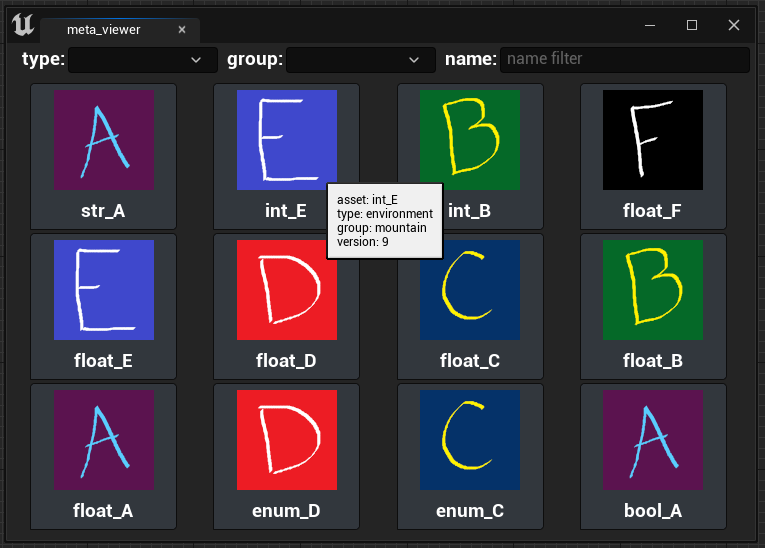
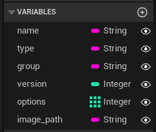
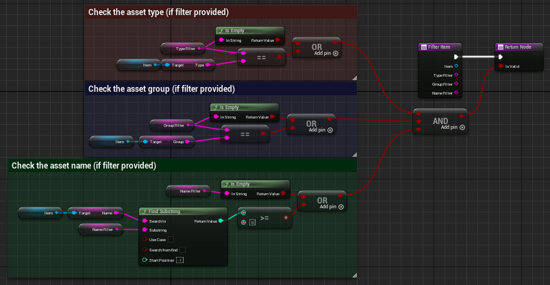
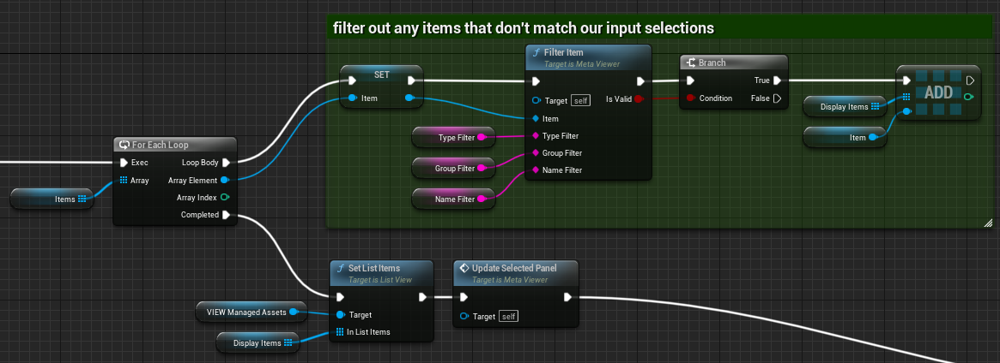
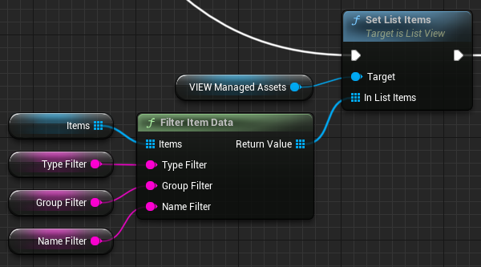

# <span style="color:white">Editor Widget Example</span>

When building Editor Utility Widgets we can use Python to create more flexible and powerful tools.
We can use Python to save or load user prefs from the user's tmp dir, we can access or manage data from outside unreal,
and we can use Python to perform some tasks more efficiently than in a Blueprint Graph.

This page covers the `meta_viewer` Editor Utility Widget found in the
[sample_tools](../unreal_plugin/PythonRecipeBook/Content/sample_tools/) plugin folder. This tool makes use
of concepts covered in the [function_libraries](./02_blueprint_function_libraries.md), [metadata](./06_using_asset_metadata.md), 
and [using_assets_in_python](./03_using_assets_in_python.md) documents

<br>

## <span style="color:yellow">The GUI</span>
<ul>

Let's start with what the user interface looks like:



This tool displays our metadata tagged assets from the 
[sample_assets](../unreal_plugin/PythonRecipeBook/Content/sample_assets/) plugin folder. 
At the top of the GUI we have filter options - setting any of these will remove any items from the GUI that
do not match our criteria. We can also mouse over an entry to see its data.

Using our input options at the top, If we filter for `environment` type assets with `t` in their name 
we're provided the following results:


That's our tool, now let's dig in!

</ul>
<br>


## <span style="color:yellow">Images from File Paths in UMG</span>
<ul>

Before we get into the Python, something worth mentioning in UMG is that we can absolutely use images from file paths!
The image icons shown are sourced from the Python folders as PNG's (not UASSETS), 
here is the blueprint logic to load them into UMG:


The [Download Image](https://docs.unrealengine.com/5.1/en-US/BlueprintAPI/Class/AsyncTaskDownloadImage/DownloadImage/)
blueprint node is used to load images from website urls, to load from a local file path instead just add a `file:///` 
prefix and it will work!

</ul>
<br>


## <span style="color:yellow">Getting the item data</span>
<ul>

To store our item data for the GUI I've set up a Blueprint Asset in the Plugin's Content dir, `meta_item_data`.
This asset will store the data required by the tile view widget.



We'll use a Python-based Blueprint Function to perform the following:
1) fetch all the metadata managed assets in the project
2) create new `meta_item_data` instances to process and store each asset's information
3) return the list of `meta_item_data` objects ready-to-use

<br>

Utilizing some functions from the [utils](../unreal_plugin/PythonRecipeBook/Content/Python/demo/utils.py#L16)
and [metadata](../unreal_plugin/PythonRecipeBook/Content/Python/demo/metadata.py#L78)
modules, here is a very watered down representation of how the tool is retrieving its contents:
```python
@unreal.ufunction(
    static=True, pure=True, 
    params=[unreal.Array(unreal.EditorUtilityObject)], # meta_item_data inherits from EditorUtilityObject,
    ret=unreal.Array(unreal.EditorUtilityObject),      # we'll use DeterminesOutputType to help Python
    meta=dict(DeterminesOutputType="array_to_match")   # return the list as meta_item_data
)
def get_item_data_for_euw(array_to_match=unreal.Array(unreal.EditorUtilityObject)):
    """retrieve a list of meta_item_data objects representing our assets in the project"""
    
    # this is the path to the item data asset we want to use for each entry
    item_template_path = "/PythonRecipeBook/sample_tools/widgets/meta_item_data"
    
    # get all of our tagged assets in the project, 
    # the default arg looks for any assets with 'managed_asset' set to 'True'
    assets = metadata.find_assets_by_metadata()

    items = []
    for asset in assets:
        # create a new instance of our item data base asset
        item = utils.new_instance_from_asset(item_template_path)
        
        # populate the item data instance from any source asset information, such as its asset name
        name = metadata.get_metadata(asset, "asset_name")
        item.set_editor_property("name", name)

        items.append(item)
    
    # return the list of items
    return items
```

The full 
[get_item_data_for_euw()](../unreal_plugin/PythonRecipeBook/Content/Python/demo/bp_library.py#L131)
function does have more code to it, the focus here is on the unreal-specific considerations and general logic flow.

    
<br>

With our Python-based BP function ready this is what it looks like in the Blueprint Graph:


Even though `Meta Item Data` is an asset made in the editor, thanks to the `DeterminesOutputType` meta decorator we can
return this custom asset class directly. Without it, this function would have returned a list of `EditorUtilityObject`s 
which would need to be cast before adding to the `Items` variable.

</ul>
<br>


## <span style="color:yellow">Filtering Item Data in Python</span>
<ul>

To handle filtering we could make a filter function to run on each item:



And then loop over each item to build a new array to populate the tile view:



Or we could use a Python Function that plugs directly into the tile view:




For the sake of a fair comparison, here's the full Python code for this function:
```python
@unreal.ufunction(
    static=True, pure=True, 
    params=[unreal.Array(unreal.EditorUtilityObject), str, str, str], 
    ret=unreal.Array(unreal.EditorUtilityObject),                     # `items` will ensure this function
    meta=dict(DeterminesOutputType="items")                           # returns a list of `meta_item_data`
)
def filter_item_data(items, type_filter, group_filter, name_filter):
    """Python Blueprint Node -- filter the given list of meta_item_data entries"""

    # nested function to make the list comprehension cleaner
    # only use the filter if it's valid, otherwise skip it (return True)
    def check_filter_match(a, b): return str(a) == str(b) if a else True

    return [
        item
        for item in items
        if check_filter_match(type_filter, item.get_editor_property("type"))
        and check_filter_match(group_filter, item.get_editor_property("group"))
        and name_filter.lower() in str(item.get_editor_property("name")).lower()
    ]
```

Like our previous Python function we can use the `items` array to ensure the return is already cast to the correct type.
Using list comprehension we can build the filtered list directly in our return. `type` and `group` do make use of a nested
function, this was done to keep the list comprehension cleaner as those filter checks should only occur if a valid filter
string was provided.

This does separate our tool's logic and adds steps to test and update our tool in Unreal, 
but it also grants us Python's conveniences and reduces the amount of Blueprint Graph bloat. 
In this situation I like that the filter logic fits on screen and is self-contained, but it's
perfectly valid to still do this in the BP graph, there's no right or wrong answer on when to use Python.

</ul>
<br>


# <span style="color:yellow">Summary</span>
<ul>

Utilizing Python for our Editor Tools can help reduce BP Graph bloat and expose new possibilities. It can be used to retrieve
data, filter any display data, and help manage our user prefs. It does have some drawbacks such as separating the logic
and adding extra steps to test updates, but it's worth keeping Python in mind the next time you build an Editor Tool in UMG!
</ul>
